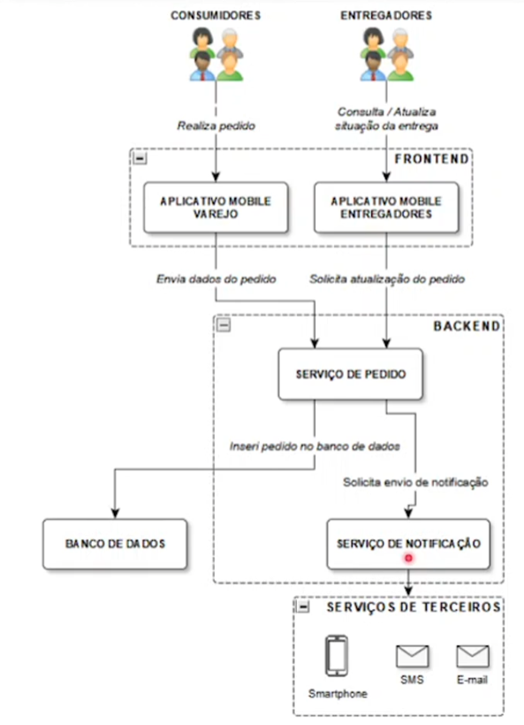
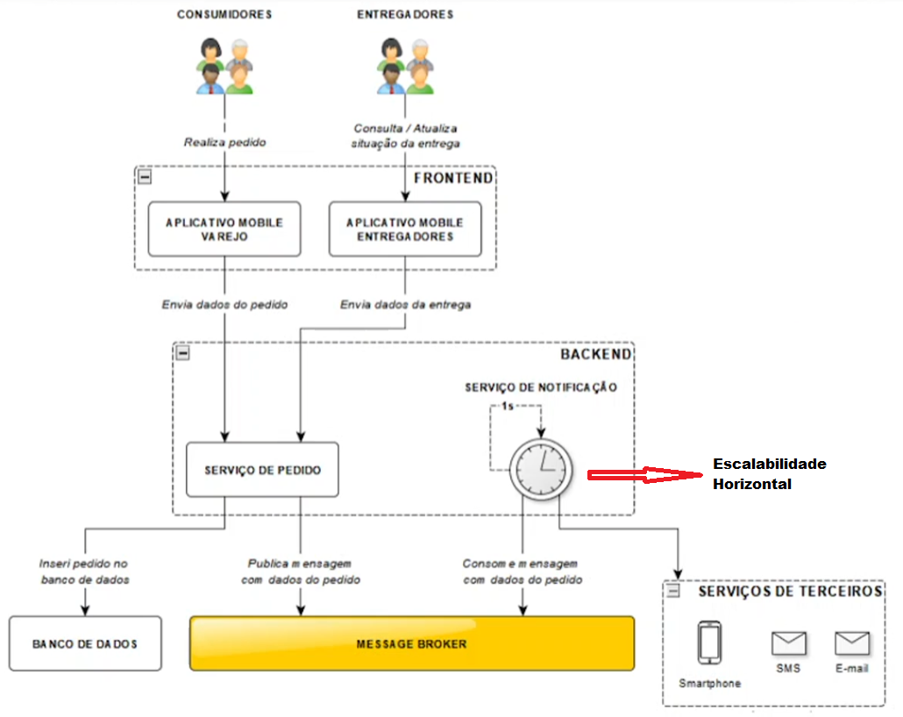

### O Projeto
---
Simulação de mensageria com Kafta e .Net 8.0
Projeto original baseado no repositório
de  https://github.com/balduinoman/netdelivery

**Curso Apache kafka + .NetCore**

Refartorei algumas coisas no projeto e o atualizei
para o .NetCore 8.0

*Uma estrutura convencional sem mensageria*

*Estrutura com uso de mensageria*

